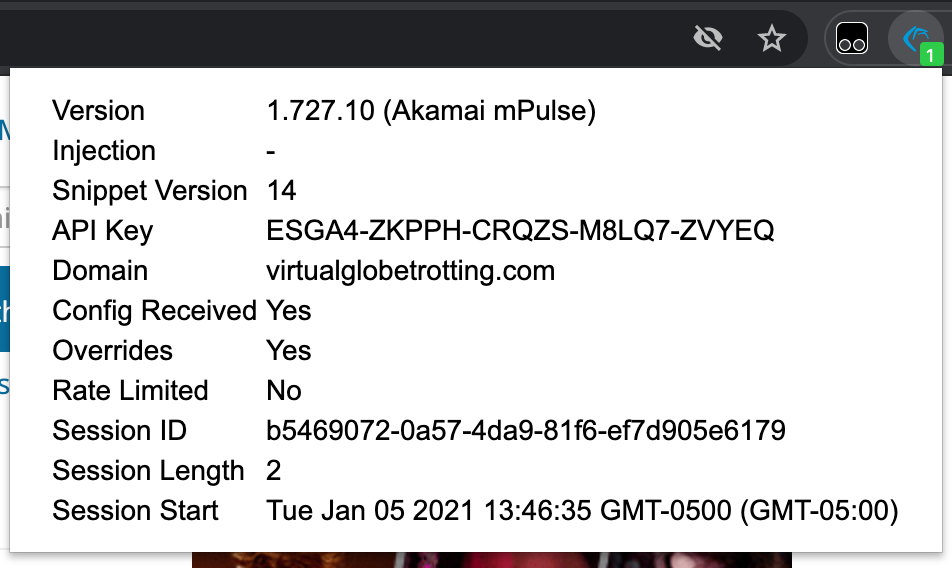
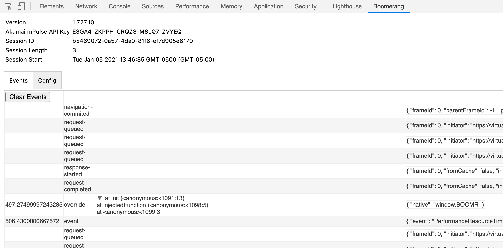

# Boomerang Inspector Browser Extension

## Summary

Provides a browser extension for quickly viewing information about the [Boomerang](https://github.com/akamai/boomerang/) library running on a page.



Also provides a devtools tab for viewing/debugging various Boomerang and page events (native overrides, network requests, History events, Boomerang beacons, etc.).




**_NOTE:_** Does not work in Safari or mobile browsers.

## Building
```
$ npm install
$ npm run-script build
```

## Loading

Per browser instructions:
### Chromium based Chrome / Edge / Opera

- Navigate to [chrome://extensions/](chrome://extensions/), [edge://extensions/](edge://extensions/) or [opera://extensions/](opera://extensions/) depending on the browser.
- Enable the "Developer mode" checkbox
- Click the "Load unpacked extension..." button and select the `dist` sub-directory

See also:
- [https://developer.chrome.com/extensions/getstarted#unpacked](https://developer.chrome.com/extensions/getstarted#unpacked)
- [https://docs.microsoft.com/en-us/microsoft-edge/extensions-chromium/getting-started/extension-sideloading](https://docs.microsoft.com/en-us/microsoft-edge/extensions-chromium/getting-started/extension-sideloading)
- [https://dev.opera.com/extensions/testing/](https://dev.opera.com/extensions/testing/)

### Firefox

- Navigate to [about:debugging](about:debugging)
- "Enable add-on debugging" checkbox (removed in newer versions)
- Click the "Load Temporary Add-on" button and select the `manifest.json` file in the `dist` sub-directory

See also [https://developer.mozilla.org/en-US/Add-ons/WebExtensions/Temporary_Installation_in_Firefox](https://developer.mozilla.org/en-US/Add-ons/WebExtensions/Temporary_Installation_in_Firefox)

### Edge (pre-Chromium)

- Navigate to [about:flags](about:flags)
- "Enable extension developer features"
- Goto Extensions in the menu
- Click the "Load extension" button and select the `dist` sub-directory
- In the extension settings, turn it on and enable "Show button next to address bar"

See also [https://docs.microsoft.com/en-us/microsoft-edge/edgehtml/extensions/guides/adding-and-removing-extensions](https://docs.microsoft.com/en-us/microsoft-edge/edgehtml/extensions/guides/adding-and-removing-extensions)
